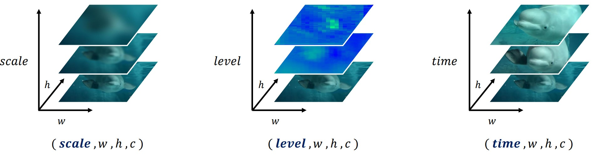
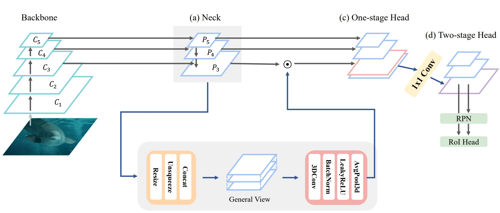

# ssFPN: Scale Sequence (S<sup>2</sup>) Feature Based-Feature Pyramid Network
#### Hye-Jin Park, Youg-Ju Choi, Young-Woon Lee, and Byung-Gyu Kim
#### Intelligent Vision Processing Lab. (IVPL), Sookmyung Women's University, Seoul, Republic of Korea
----------------------------
#### This repository is the official PyTorch implementation of the paper archived in _ssFPN: Scale Sequence (S<sup>2</sup>) Feature Based-Feature Pyramid Network for Object Detection, arXiv [Categories: Computer Vision and Pattern Recognition (cs.CV)], arXiv ( https://arxiv.org/abs/2208.11533 )_.
[](https://arxiv.org/abs/2208.11533)

<p align="center">



</p>

----------------------------

## Installation
```
# download COCO dataset

git clone https://github.com/smu-ivpl/ssFPN.git

cd yolo4

# install mish-cuda, if you use different pytorch version, you could try https://github.com/thomasbrandon/mish-cuda
git clone https://github.com/JunnYu/mish-cuda
cd mish-cuda
python setup.py build install

cd ..
```

### Environment
- Ubuntu 18.04 with Tesla V100
- Cuda 10.2
- torch 1.9.0
- torchvision 0.10.0
```
pip install -r requirements.txt
```

## Test COCO test-dev

#### 1. Create COCO test-dev result json file
```
python test.py --img 1280 --conf 0.001 --batch 8 --device 0 --data coco.yaml --weights weights/yolov4-p6-s2.pt --task test
```

#### 2. Rename json file: "[type]\_[testset]\_[alg]_results.zip"
```
detections_val2017__results.json -> detections_test-dev2017_yolov4p6s2_results.json
```

#### 3. Place the JSON file into a zip file 
```
detections_test-dev2017_yolov4p6s2_results.zip
```

#### 4. Submit zip to [COCO challenge official server](https://codalab.lisn.upsaclay.fr/competitions/7384#participate-submit_results)

<br>

## Test COCO validation
```
python test.py --img 1280 --conf 0.001 --batch 8 --device 0 --data coco.yaml --weights weights/yolov4-p6-s2.pt
```
You will get following results:
```
# yolov4-p6-s2
 Average Precision  (AP) @[ IoU=0.50:0.95 | area=   all | maxDets=100 ] = 0.544
 Average Precision  (AP) @[ IoU=0.50      | area=   all | maxDets=100 ] = 0.726
 Average Precision  (AP) @[ IoU=0.75      | area=   all | maxDets=100 ] = 0.597
 Average Precision  (AP) @[ IoU=0.50:0.95 | area= small | maxDets=100 ] = 0.393
 Average Precision  (AP) @[ IoU=0.50:0.95 | area=medium | maxDets=100 ] = 0.588
 Average Precision  (AP) @[ IoU=0.50:0.95 | area= large | maxDets=100 ] = 0.669
 Average Recall     (AR) @[ IoU=0.50:0.95 | area=   all | maxDets=  1 ] = 0.400
 Average Recall     (AR) @[ IoU=0.50:0.95 | area=   all | maxDets= 10 ] = 0.668
 Average Recall     (AR) @[ IoU=0.50:0.95 | area=   all | maxDets=100 ] = 0.726
 Average Recall     (AR) @[ IoU=0.50:0.95 | area= small | maxDets=100 ] = 0.599
 Average Recall     (AR) @[ IoU=0.50:0.95 | area=medium | maxDets=100 ] = 0.763
 Average Recall     (AR) @[ IoU=0.50:0.95 | area= large | maxDets=100 ] = 0.845

```

## Training

```
# yolov4-p6-s2
python -m torch.distributed.launch --nproc_per_node 3 train.py --batch-size 21 --img 1280 1280 --data data/coco.yaml --cfg models/yolov4-p6-sequence.yaml --sync-bn --epochs 300 --name yolov4-p6-s2 --device 0,1,2
python -m torch.distributed.launch --nproc_per_node 3 train.py --batch-size 21 --img 1280 1280 --data data/coco.yaml --cfg models/yolov4-p6-sequence.yaml --weight runs/exp0_yolov4-p6-s2/weights/last_298.pt --sync-bn --device 0,1,2,3 --name yolov4-p6-s2-tune --hyp 'data/hyp.finetune.yaml' --epochs 450 --resume
```

## Acknowledgements

<details><summary> <b>Expand</b> </summary>

* [https://github.com/AlexeyAB/darknet](https://github.com/AlexeyAB/darknet)
* [https://github.com/WongKinYiu/PyTorch_YOLOv4](https://github.com/WongKinYiu/PyTorch_YOLOv4)
* [https://github.com/ultralytics/yolov3](https://github.com/ultralytics/yolov3)
* [https://github.com/ultralytics/yolov5](https://github.com/ultralytics/yolov5)
* [https://github.com/WongKinYiu/ScaledYOLOv4](https://github.com/WongKinYiu/ScaledYOLOv4)

</details>
