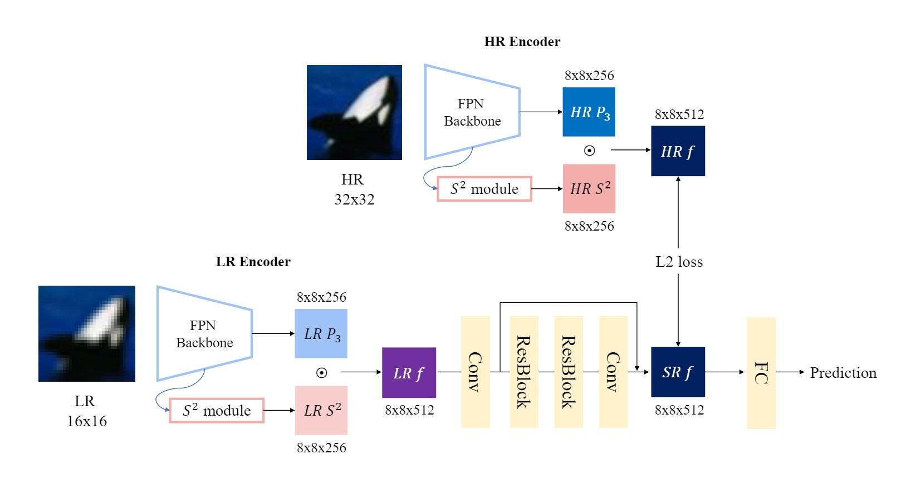

# Feature-level Super Resolution based on Scale Sequence (S<sup>2</sup>) Feature

<p align="center">

</p>

-----
### Environment
- Ubuntu 18.04 with Tesla V100
- torch 1.8.1
- torchvision 0.9.1
```
pip install matplotlib
pip install tensorboard
pip install horovod 
pip install scikit-image 
pip install pickle5 
```

### CIFAR-100 Dataset
- download cifar-100-python dataset: ./data
- download hr feature for training super-resolution : [Download cifar-100-feature dataset](https://drive.google.com/drive/folders/17pTfcEsxAX6YGbuclQJqGCJ-_NvAznk2?usp=share_link)


### Test 
- [Download checkpoint](https://drive.google.com/drive/folders/17pTfcEsxAX6YGbuclQJqGCJ-_NvAznk2?usp=share_link)
```
python test.py -net resnet101_fpn -weight checkpoint/resnet101_fpn/SR_cls/SR_cls_55.2.pth
```


### Training

```
# train resnet101
python train.py -net resnet101

# train sr 
python train_SR.py
python train_SR_cls.py.py
```

